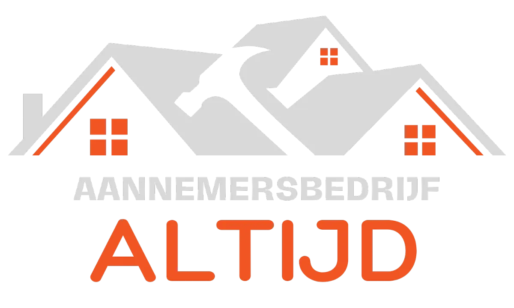

 Conversation compacted (ctrl+o for history)

  ⎿  Referenced file algemene-voorwaarden.html
  ⎿  Referenced file hellende-daken.html
  ⎿  Referenced file index.html
  ⎿  Read ..\AppData\Local\Temp\claude\C--Users-mazin-Kalkema-naar-Altijd\63b93a49-221b-4990-9296-1e239e0a5134\tasks\bsv8mvhhk.output (45 lines)   
  ⎿  Read ..\AppData\Local\Temp\claude\C--Users-mazin-Kalkema-naar-Altijd\63b93a49-221b-4990-9296-1e239e0a5134\tasks\bx975znsl.output (19 lines)   

● Let me read the current files to find all "Utrecht" references.

  Searched for 1 pattern (ctrl+o to expand)

● Now I'll update all the messaging across all three files. Let me do the edits in parallel where possible.

  Read 1 file (ctrl+o to expand)

● Now I'll make all the edits across all three files:

● Update(index.html)
  ⎿  Added 1 line, removed 1 line
      1399      

      1400
      1401      

      1402 -      
Dakdekker &amp; aannemer in Utrecht
                                                                
      1402 +      
Dakdekker &amp; aannemer door heel Nederland
                                                       
      1403
      1404        <h1 class="hero-title">
      1405          Aannemers&shy;bedrijf

● Update(index.html)
  ⎿  Added 1 line, removed 1 line
      1409        
Van dak tot gevel. Altijd vakwerk.

      1410
      1411        

      1412 -        Dakdekker, aannemer en renovatiespecialist in Utrecht en omgeving — voor particulieren en bedrijven.                           
      1412 +        Dakdekker, aannemer en renovatiespecialist door heel Nederland — voor particulieren en bedrijven.                              
      1413          Snel, betrouwbaar en altijd scherp geprijsd.
      1414        

      1415

● Update(index.html)
  ⎿  Added 2 lines, removed 2 lines
      1443          

      1444          

 Particulier &amp; Zakelijk

      1445          

      1446 -        

 Utrecht &amp; Omgeving
                                          
      1446 +        

 Heel Nederland
                                                  
      1447          

      1448          

 Reactie Binnen 24 Uur

      1449          

     ...
      1460          

      1461          

 Particulier &amp; Zakelijk

      1462          

      1463 -        

 Utrecht &amp; Omgeving
                                          
      1463 +        

 Heel Nederland
                                                  
      1464          

      1465          

 Reactie Binnen 24 Uur

      1466          

● Update(index.html)
  ⎿  Added 2 lines, removed 2 lines
      1700          

      1701          

 Netjes Opgeleverd

      1702          

      1703 -        

 Utrecht &amp; Omgeving
                                                    
      1703 +        

 Heel Nederland
                                                            
      1704          

      1705          

 Afspraken Nagekomen

      1706          

     ...
      1718          

      1719          

 Netjes Opgeleverd

      1720          

      1721 -        

 Utrecht &amp; Omgeving
                                                    
      1721 +        

 Heel Nederland
                                                            
      1722          

      1723          

 Afspraken Nagekomen

      1724          

● Update(index.html)
  ⎿  Added 1 line, removed 1 line
      1915        

      1916          
      1917          

      1918 -          Uw betrouwbare dakdekker en aannemer in Utrecht en omgeving. Van hellende en platte daken tot timmerwerk en schilderwe       
           -rk — altijd vakwerk, altijd op tijd.                                                                                                   
      1918 +          Uw betrouwbare dakdekker en aannemer actief door heel Nederland. Van hellende en platte daken tot timmerwerk en schild       
           +erwerk — altijd vakwerk, altijd op tijd.                                                                                               
      1919          

      1920          

      1921            

● Update(index.html)
  ⎿  Added 1 line, removed 1 line
      1968          </ul>
      1969          

      1970            
Werkgebied

      1971 -          
Utrecht &amp; omgeving
                                  
      1971 +          
Noord-Holland · Zuid-Holland · Utrecht · Noord-Braban       
           +t · Gelderland · Overijssel · Flevoland · Groningen · Friesland · Drenthe
                                                          
      1972          

      1973        

      1974

● Now update hellende-daken.html:

  Read 1 file (ctrl+o to expand)

● Update(hellende-daken.html)
  ⎿  Added 5 lines, removed 5 lines
       3  <head>
       4    <meta charset="UTF-8" />
       5    <meta name="viewport" content="width=device-width, initial-scale=1.0" />
       6 -  <title>Hellende Daken Utrecht — Aannemersbedrijf Altijd</title>                                                                        
       7 -  <meta name="description" content="Specialist in hellende daken in Utrecht en omgeving. Leggen, herstellen en onderhouden van dak       
         -pannen, leien en bitumen. Gratis offerte binnen 24 uur." />                                                                              
       8 -  <meta name="keywords" content="hellend dak, dakdekker Utrecht, dakpannen, leien, bitumen, dak renovatie" />                            
       6 +  <title>Hellende Daken — Aannemersbedrijf Altijd | Heel Nederland</title>                                                               
       7 +  <meta name="description" content="Specialist in hellende daken door heel Nederland. Leggen, herstellen en onderhouden van dakpan       
         +nen, leien en bitumen. Gratis offerte binnen 24 uur." />                                                                                 
       8 +  <meta name="keywords" content="hellend dak, dakdekker Nederland, dakpannen, leien, bitumen, dak renovatie" />                          
       9    <meta name="robots" content="index, follow" />
      10 -  <meta property="og:title" content="Hellende Daken — Aannemersbedrijf Altijd Utrecht" />                                                
      11 -  <meta property="og:description" content="Vakkundige dakdekker voor hellende daken in Utrecht. Nieuwbouw, renovatie en onderhoud.       
         -" />                                                                                                                                     
      10 +  <meta property="og:title" content="Hellende Daken — Aannemersbedrijf Altijd | Heel Nederland" />                                       
      11 +  <meta property="og:description" content="Vakkundige dakdekker voor hellende daken door heel Nederland. Nieuwbouw, renovatie en o       
         +nderhoud." />                                                                                                                            
      12    <meta property="og:type" content="website" />
      13    <link rel="preconnect" href="https://fonts.googleapis.com" />
      14    <link rel="preconnect" href="https://fonts.gstatic.com" crossorigin />

● Update(hellende-daken.html)
  ⎿  Added 1 line, removed 1 line
      753      

      754
      755      

      756 -      
Dakdekker Utrecht — Specialist hellende daken
                                                       
      756 +      
Dakdekker door heel Nederland — Specialist hellende daken
                                           
      757        <h1 class="hero-title">
      758          Hellende
      759          Daken

● Update(hellende-daken.html)
  ⎿  Added 1 line, removed 1 line
      760        </h1>
      761        
Leggen. Renoveren. Onderhouden.

      762        

      763 -        Vakkundige dakdekker voor hellende daken in Utrecht en omgeving. Nieuwbouw, renovatie of onderhoud — wij zorgen dat uw da       
          -k er jarenlang tegenaan kan.                                                                                                            
      763 +        Vakkundige dakdekker voor hellende daken door heel Nederland. Nieuwbouw, renovatie of onderhoud — wij zorgen dat uw dak e       
          +r jarenlang tegenaan kan.                                                                                                               
      764        

      765        

      766          <button class="btn-primary" onclick="openPopup()">Gratis Offerte</button>

● Update(hellende-daken.html)
  ⎿  Added 2 lines, removed 2 lines
      789          

      790          

 Particulier &amp; Zakelijk

      791          

      792 -        

 Utrecht &amp; Omgeving
                                           
      792 +        

 Heel Nederland
                                                   
      793          

      794          

 Reactie Binnen 24 Uur

      795          

     ...
      807          

      808          

 Particulier &amp; Zakelijk

      809          

      810 -        

 Utrecht &amp; Omgeving
                                           
      810 +        

 Heel Nederland
                                                   
      811          

      812          

 Reactie Binnen 24 Uur

      813          

● Update(hellende-daken.html)
  ⎿  Added 1 line, removed 1 line
      828          Een <strong>hellend dak</strong> heeft een helling van meer dan 15 graden en wordt bedekt met dakpannen, leien, riet of b       
           itumen golfplaten. Het is de meest voorkomende daksoort in Nederland en vereist <strong>gespecialiseerd vakwerk</strong> voor een       
            goede waterdichting en isolatie.
      829        

      830        

      831 -        Aannemersbedrijf Altijd is uw specialist voor de aanleg, renovatie en het onderhoud van hellende daken in Utrecht en omge       
          -ving. Wij werken met <strong>hoogwaardig materiaal</strong> en leveren elk project netjes en op tijd op.                                
      831 +        Aannemersbedrijf Altijd is uw specialist voor de aanleg, renovatie en het onderhoud van hellende daken door heel Nederlan       
          +d. Wij werken met <strong>hoogwaardig materiaal</strong> en leveren elk project netjes en op tijd op.                                   
      832        

      833        

      834          

● Update(hellende-daken.html)
  ⎿  Added 2 lines, removed 2 lines
      959          

 €0 Onverwachte Kosten

      960          

 Vakkundig Uitgevoerd

      961          

 Netjes Opgeleverd

      962 -        

 Utrecht &amp; Omgeving

                        
      962 +        

 Heel Nederland

                                
      963          

 Afspraken Nagekomen

      964        

      965        

     ...
      969          

 €0 Onverwachte Kosten

      970          

 Vakkundig Uitgevoerd

      971          

 Netjes Opgeleverd

      972 -        

 Utrecht &amp; Omgeving

                        
      972 +        

 Heel Nederland

                                
      973          

 Afspraken Nagekomen

      974        

      975      

● Update(hellende-daken.html)
  ⎿  Added 1 line, removed 1 line
      1121      

      1122        

      1123          
      1124 -        
Uw betrouwbare dakdekker en aannemer in Utrecht en omgeving. Van hellende en platte daken t       
           -ot timmerwerk en schilderwerk — altijd vakwerk, altijd op tijd.
                                                                    
      1124 +        
Uw betrouwbare dakdekker en aannemer actief door heel Nederland. Van hellende en platte dak       
           +en tot timmerwerk en schilderwerk — altijd vakwerk, altijd op tijd.
                                                                
      1125          

      1126            
<svg viewBox="0 0 24 24" fill="none" stroke="currentColor" stroke-width="2"><path d="       
            M22 16.92v3a2 2 0 0 1-2.18 2 19.79 19.79 0 0 1-8.63-3.07A19.5 19.5 0 0 1 4.07 12 19.79 19.79 0 0 1 1 3.18 2 2 0 0 1 3 1h3a2 2 0        
            0 1 2 1.72c.127.96.361 1.903.7 2.81a2 2 0 0 1-.45 2.11L7.09 8.91a16 16 0 0 0 6 6l1.27-1.27a2 2 0 0 1 2.11-.45c.907.339 1.85.573        
            2.81.7A2 2 0 0 1 21 16z"/></svg>

      1127            
Telefoon<a href="tel:+31348234960" class="footer-contact-value">348 234       
             960</a>

● Update(hellende-daken.html)
  ⎿  Added 1 line, removed 1 line
      1159          </ul>
      1160          

      1161            
Werkgebied

      1162 -          
Utrecht &amp; omgeving
                                  
      1162 +          
Noord-Holland · Zuid-Holland · Utrecht · Noord-Braban       
           +t · Gelderland · Overijssel · Flevoland · Groningen · Friesland · Drenthe
                                                          
      1163          

      1164        

      1165      

● Now algemene-voorwaarden.html:

● Update(algemene-voorwaarden.html)
  ⎿  File must be read first

  Read 1 file (ctrl+o to expand)

● Update(algemene-voorwaarden.html)
  ⎿  Added 1 line, removed 1 line
      586      

      587        

      588          
      589 -        
Uw betrouwbare dakdekker en aannemer in Utrecht en omgeving. Altijd vakwerk, altijd op tijd.       
          -
                                                                                                                                    
      589 +        
Uw betrouwbare dakdekker en aannemer actief door heel Nederland. Altijd vakwerk, altijd op t       
          +ijd.
                                                                                                                                
      590          

      591            
<svg viewBox="0 0 24 24" fill="none" stroke="currentColor" stroke-width="2"><path d="M       
           22 16.92v3a2 2 0 0 1-2.18 2 19.79 19.79 0 0 1-8.63-3.07A19.5 19.5 0 0 1 4.07 12 19.79 19.79 0 0 1 1 3.18 2 2 0 0 1 3 1h3a2 2 0 0        
           1 2 1.72c.127.96.361 1.903.7 2.81a2 2 0 0 1-.45 2.11L7.09 8.91a16 16 0 0 0 6 6l1.27-1.27a2 2 0 0 1 2.11-.45c.907.339 1.85.573 2.8       
           1.7A2 2 0 0 1 21 16z"/></svg>

      592            
Telefoon<a href="tel:+31348234960" class="footer-contact-value">348 234        
           960</a>

● Now check if algemene-voorwaarden.html also has a Werkgebied section:

  Searched for 1 pattern (ctrl+o to expand)

● Good. Now let me create the privacy/cookies policy page. Let me look at the structure of algemene-voorwaarden.html to match the style:

  Read 1 file (ctrl+o to expand)

● Now let me read the full AV page structure to understand the layout pattern I should replicate:

  Read 1 file (ctrl+o to expand)

● Now I'll create the privacy page:

  Read 1 file (ctrl+o to expand)

● I have enough context. Now I'll create the privacy.html page:

● Now I have enough context. Let me create the privacy page:

● Write(privacy.html)
  ⎿  Wrote 705 lines to privacy.html
       1 <!DOCTYPE html>
       2 <html lang="nl">
       3 <head>
       4   <meta charset="UTF-8" />
       5   <meta name="viewport" content="width=device-width, initial-scale=1.0" />
       6   <title>Privacybeleid &amp; Cookiebeleid — Aannemersbedrijf Altijd</title>
       7   <meta name="description" content="Privacybeleid en cookiebeleid van Aannemersbedrijf Altijd. Lees hoe wij omgaan met uw persoonsg       
         egevens en cookies." />
       8   <meta name="robots" content="index, follow" />
       9   <link rel="preconnect" href="https://fonts.googleapis.com" />
      10   <link rel="preconnect" href="https://fonts.gstatic.com" crossorigin />
     … +695 lines (ctrl+o to expand)

● Now update the footer "Privacy" links in the other pages to point to privacy.html, and update algemene-voorwaarden.html to also link to
  privacy.html:

  Searched for 1 pattern (ctrl+o to expand)

● Update(algemene-voorwaarden.html)
  ⎿  Added 1 line, removed 1 line
      620      

      621        &copy; 2026 Aannemersbedrijf Altijd. Alle rechten voorbehouden.
      622        <ul class="footer-legal">
      623 -        <li><a href="#">Privacy</a></li>                                                                                                
      623 +        <li><a href="privacy.html">Privacy</a></li>                                                                                     
      624          <li><a href="algemene-voorwaarden.html">Algemene Voorwaarden</a></li>
      625          <li><a href="index.html#contact">Contact</a></li>
      626        </ul>

● Update(hellende-daken.html)
  ⎿  Added 1 line, removed 1 line
      1166      

      1167        &copy; 2026 Aannemersbedrijf Altijd. Alle rechten voorbehouden.
      1168        <ul class="footer-legal">
      1169 -        <li><a href="#">Privacy</a></li>                                                                                               
      1169 +        <li><a href="privacy.html">Privacy</a></li>                                                                                    
      1170          <li><a href="#">Algemene Voorwaarden</a></li>
      1171          <li><a href="index.html#contact">Contact</a></li>
      1172        </ul>

● Update(index.html)
  ⎿  Added 1 line, removed 1 line
      1977      

      1978        &copy; 2026 Aannemersbedrijf Altijd. Alle rechten voorbehouden.
      1979        <ul class="footer-legal">
      1980 -        <li><a href="#">Privacy</a></li>                                                                                               
      1980 +        <li><a href="privacy.html">Privacy</a></li>                                                                                    
      1981          <li><a href="#">Algemene Voorwaarden</a></li>
      1982          <li><a href="index.html#contact">Contact</a></li>
      1983        </ul>

● Alles is bijgewerkt. Dit is wat er gedaan is:

  Werkgebied messaging — alle "Utrecht & omgeving" vervangen door "Heel Nederland" in:
  - Hero labels & taglines (index.html + hellende-daken.html)
  - Tickers (beide sets)
  - Stats-balken
  - Intro-tekst
  - Footer brand-tekst
  - Footer Werkgebied sectie → volledige provincienlijst: Noord-Holland · Zuid-Holland · Utrecht · Noord-Brabant · Gelderland · Overijssel ·       
  Flevoland · Groningen · Friesland · Drenthe
  - SEO meta-tags van hellende-daken.html

  Privacy & Cookiebeleid pagina (privacy.html) — nieuw aangemaakt met:
  - Zelfde design tokens, nav en footer als de andere pagina's
  - Sticky sidebar TOC met 10 artikelen
  - AVG-conform inhoud: wie zijn wij, welke gegevens, verwerkingsdoelen + grondslagen, bewaartermijnen, delen met derden, cookie-tabel (functioneel
   + analytisch), beveiliging, uw rechten (art. 8.1–8.6), klachten & Autoriteit Persoonsgegevens, wijzigingen
  - "PB" deco letter in de header
  - Privacy-link in alle vier pagina's bijgewerkt van # naar privacy.html

✻ Worked for 14m 25s

❯ kan je precies zoals je hellende dak hebt gefixt, die landingspagina, ook de rest van de landingspagina fixen op deze manier dat het er zo uit   
ziet, maar dan uiteraard met de relevante info over de dienst zelf. Geen neppe beloftes erin of valse praatjes                                     

● Laat me eerst de volledige structuur van hellende-daken.html lezen zodat ik het patroon exact kan repliceren.

  Read 1 file (ctrl+o to expand)

● Goed, ik heb de volledige structuur. Nu ga ik alle 10 resterende dienst-pagina's aanmaken. Dit is flink werk, ik doe het via een subagent die    
  alles parallel uitwerkt.

  Read 1 file (ctrl+o to expand)

● Nu ga ik alle 10 pagina's aanmaken. Ik gebruik een agent die ze parallel kan schrijven zodat het sneller gaat.

  Read 1 file (ctrl+o to expand)

● Ik heb alles wat ik nodig heb. Ik ga nu alle 10 pagina's aanmaken via een agent die dit parallel kan uitwerken.

● Nu ga ik alle 10 resterende landingspagina's aanmaken. Ze volgen exact dezelfde structuur, elk met dienst-specifieke content. Ik doe ze in       
  batches:

  Searched for 1 pattern (ctrl+o to expand)

● Update(hellende-daken.html)
  ⎿  Added 1 line, removed 1 line
      1167        &copy; 2026 Aannemersbedrijf Altijd. Alle rechten voorbehouden.
      1168        <ul class="footer-legal">
      1169          <li><a href="privacy.html">Privacy</a></li>
      1170 -        <li><a href="#">Algemene Voorwaarden</a></li>                                                                                  
      1170 +        <li><a href="algemene-voorwaarden.html">Algemene Voorwaarden</a></li>                                                          
      1171          <li><a href="index.html#contact">Contact</a></li>
      1172        </ul>
      1173      

● Nu schrijf ik de 10 pagina's. Ik gebruik een agent zodat ze tegelijk gebouwd worden:

● Nu ga ik alle pagina's schrijven. Ik gebruik een agent om ze parallel te bouwen — dit zijn 10 grote bestanden die allemaal dezelfde zware        
  CSS-structuur delen:

● Agent(Create 10 dienst landing pages)
  ⎿  Done (29 tool uses · 0 tokens · 1h 6m 1s)                               
  (ctrl+o to expand)                                                   
  ⎿  You've hit your limit · resets 7am (Europe/Amsterdam)
                                                               